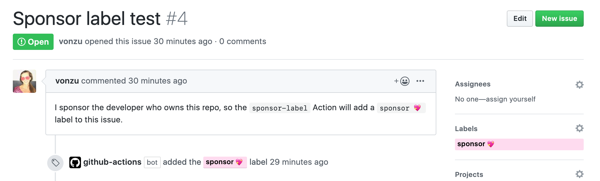

<h1 align="center">[WIP]</h1>
<h3 align="center">A GitHub Action that labels issues/PRs if the creator is a sponsor of the owner</h3>

**Note**: currently only works for user-owned repositories. This is due to a limitation of the GraphQL API, since we can't query for a "user or organization" in one request.

## Examples

Imagine Alice sponsors Bob through GitHub Sponsors, and Bob owns a public repo, which includes this `sponsor-label` action. Then, when Alice opens an issue or PR on that repo, a bot will automatically add a `sponsor 💖` label.



You can see the above example here: https://github.com/devonzuegel/highly-exporter/issues/4

## Usage

You can create a `.github/workflows/label-sponsors.yml` file:

```yaml
name: Label sponsors
on:
  pull_request:
    types: [opened]
  issues:
    types: [opened]
jobs:
  build:
    name: is-sponsor-label
    runs-on: ubuntu-latest
    steps:
      - uses: JasonEtco/is-sponsor-label-action@master
        env:
          GITHUB_TOKEN: ${{ secrets.GITHUB_TOKEN }}
```

This will trigger the action when an issue or pull request is opened. You'll need to include the `GITHUB_TOKEN` environment variable!

By default, the label `sponsor` will be applied. If you have a different label you want to use, you can set that:

```yaml
      - uses: JasonEtco/is-sponsor-label-action@master
        with:
          label: Sponsor Request ❤️
        env:
          GITHUB_TOKEN: ${{ secrets.GITHUB_TOKEN }}
```

## How it works

This action is designed to be triggered by the `issues` or `pull_request` events, specifically the `opened` action. When an issue or PR is opened, the action will make the following query:

```graphql
query ($owner: String!) { 
  user (login: $owner) {
    sponsorshipsAsMaintainer (first: 100) {
      nodes {
        sponsor {
          id
        }
      }
    }
  }
}
```

It will then check to see if the creator of the issue/PR is one of the sponsors in the list. If not, it'll try the next page of sponsors until it runs out.

> Note! This query checks to see if the opener is a sponsor of the repository's owning user. This does not cover all cases of sponsorship!

If the opener is a sponsor, the action will then add the `sponsor` label to the issue or pull request.
